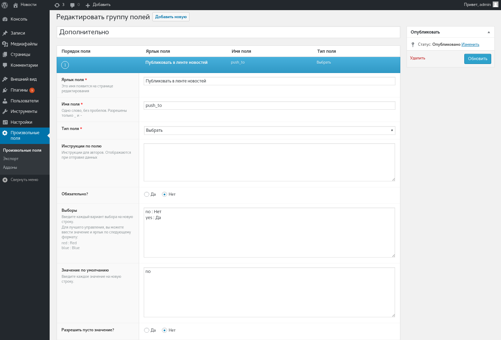
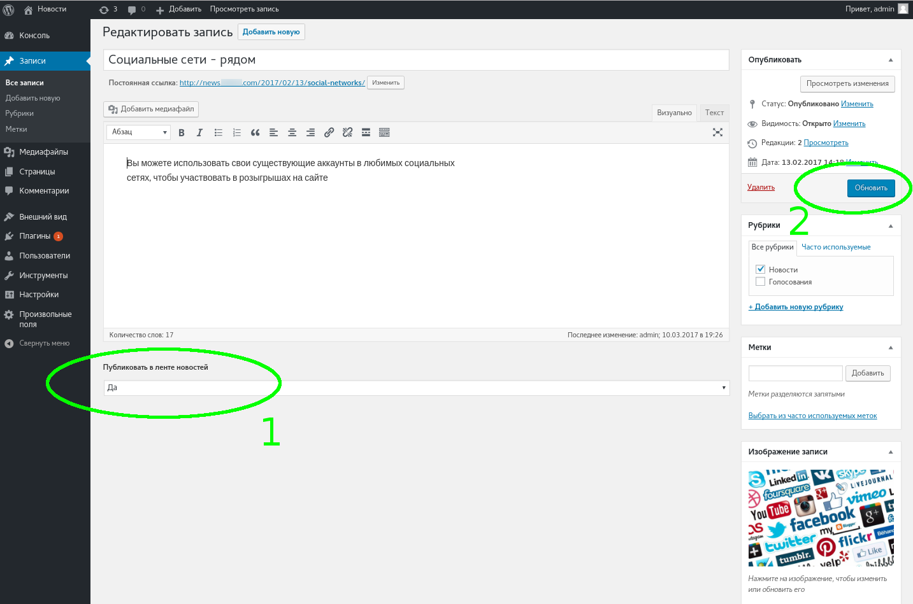

Плагин **Post To OpenCart** предназначен для публикации постов из WordPress в OpenCart 2.3.x.

После установки и активации плагина на странице "Настройки > Post To OpenCart":

* Установить адрес сайта в поле **OpenCart URL**
* Установить ключ в поле **OpenCart API Key**. 


Ключ API можно найти в админ панели OpenCart на странице "Система > Пользователи > API".

Для работы плагина необходимо добавить дополнительное поле в редактор постов. Для этого установить плагин **Advanced Custom Fields** и настроить дополнительное поле:

* тип записи - post
* ярлык поля - Публиковать в ленте новостей LikBET
* имя поля - push_to_likbet
* выборы -
```
no : Нет
yes : Да
```



После этого в редакторе постов появляется поле "Публиковать в ленте новостей". Выбрав опцию **Да** и нажав кнопку **Публиковать** (**Обновить**) происходит сохранение текущего поста на сайт OpenCart:




## Настройки OpenCart

В админ панели OpenCart необходимо разрешить доступ к API с сайта новостей. Лента новостей может принимать и сохранять посты от нескольких разных сайтов. Для этого на странице "Система > Пользователи > API" добавить новый ключ API для каждого источника (доменного имени). Во вкладке **IP адрес** добавить реальный IP адрес новостного сайта:

