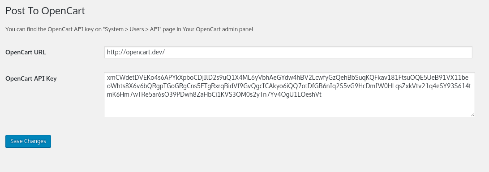

# Post To OpenCart Plugin

This plugin allows to publish WP posts to OpenCart.

### Installation

1. Upload `wp-post-to-opencart` to the `/wp-content/plugins/`  directory
2. Activate the plugin through the 'Plugins' menu in WordPress
3. Set 'OpenCart URL' option.
4. Set 'OpenCart API Key'. You can find the OpenCart API key on "System > Users > API" page in Your OpenCart admin panel

### Screenshots

